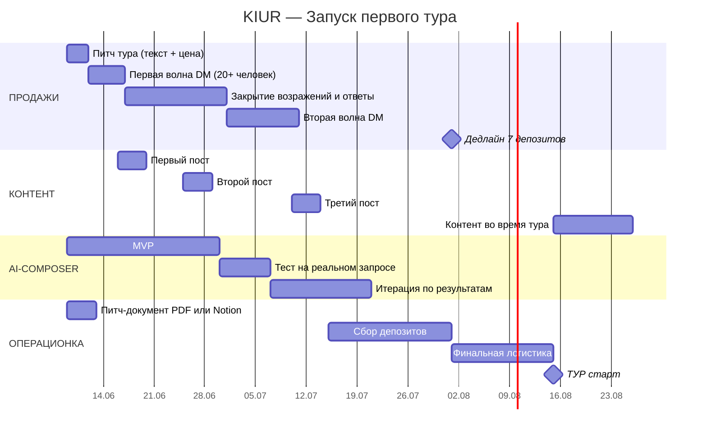

# РОАДМАП ЗАПУСКА — KIUR
> Период: 9 июня — 25 августа 2026  
> North Star: минимум 7 человек в туре к 1 августа

---

## GANTT

---

## ДЕТАЛИ ПО СПРИНТАМ

### СПРИНТ 1 — Фундамент (9–15 июня)
| # | Задача | DoD | Кто |
|---|---|---|---|
| 1 | Написать питч тура: маршрут, цена, даты, состав группы | Текст готов, отправлен первым 5 людям | Фаундер |
| 2 | Список 20+ потенциальных клиентов из контактов | Google Sheet с именами и статусом | Фаундер |
| 3 | Запустить первую волну DM | 20 сообщений отправлено, ответы зафиксированы | Фаундер |

### СПРИНТ 2 — Контент + продажи (16–30 июня)
| # | Задача | DoD | Кто |
|---|---|---|---|
| 4 | Первый пост в Instagram/TikTok: маршрут тура | Опубликован, 50+ просмотров | Фаундер |
| 5 | Закрыть первые 3 подтверждения с депозитом | 3 депозита на счету | Фаундер |
| 6 | MVP AI-composer: базовый флоу работает | Можно ввести параметры и получить маршрут | Разработка |

### СПРИНТ 3 — Закрытие группы (1–31 июля)
| # | Задача | DoD | Кто |
|---|---|---|---|
| 7 | Вторая волна DM (знакомые знакомых) | +20 новых контактов охвачено | Фаундер |
| 8 | Второй и третий контент-пост | 2 поста опубликовано | Фаундер |
| 9 | **ДЕДЛАЙН 1 августа: 7+ подтверждений** | 7+ депозитов на счету | Фаундер |
| 10 | Финальная логистика: трансферы, отели | Все брони подтверждены письменно | Фаундер |

### ТУР (15–25 августа)
| # | Задача | DoD |
|---|---|---|
| 11 | Стихийный контент каждый день | 1 пост или сторис в день |
| 12 | Сбор обратной связи от участников | Устный опрос в последний день |
| 13 | Post-mortem тура: что изменить | Документ с выводами в репо |

---

## ТРИГГЕРЫ ПЕРЕСМОТРА ПЛАНА

| Ситуация | Действие |
|---|---|
| К 1 июля < 4 подтверждений | Расширить охват: посты в русскоязычных тревел-чатах |
| К 15 июля < 6 подтверждений | Подключить рекламу в Instagram (€50–100 тест) |
| К 1 августа < 7 человек | Перенести тур или снизить n_min до 6 (пересчитать цену) |

---

## МЕТРИКИ КОНТРОЛЯ

| Метрика | Цель | Дедлайн |
|---|---|---|
| DM отправлено | 40+ | 30 июня |
| Конверсия DM в интерес | >20% (8+ человек) | 15 июля |
| Депозиты получены | 7+ | 1 августа |
| Контент-посты опубликовано | 3 | 15 августа |
| AI-composer MVP готов | Да/Нет | 30 июня |

---

*Создан: 09.06.2026*
